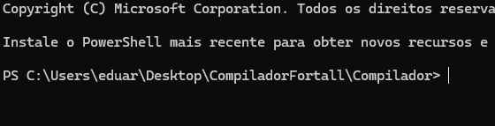
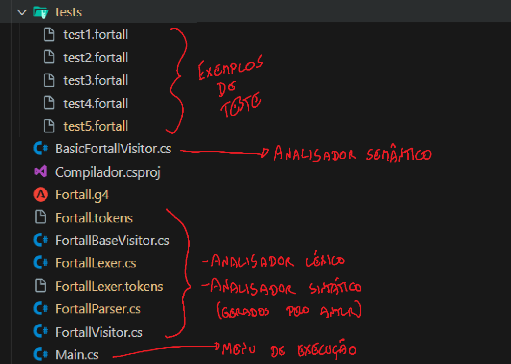
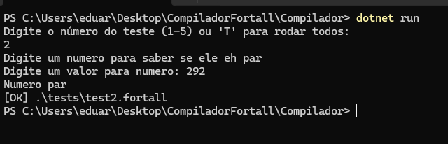

# Compilador de "Fortall"
#### Gramática definida baseada na linguagem Fortall:

grammar Fortall;

program             : line* EOF ;
line                : statement | whileBlock | ifBlock | print | input;
statement           : assignment ';';

print               : 'print' '(' expression ')' ';' ;
input               : 'input' '(' ID ')' ';';
ifBlock             : 'if' expression block ('else' elseIfBlock)*;
elseIfBlock         : block | ifBlock;
whileBlock          : 'while' expression block ;
assignment          : ID '=' expression ;

expression          : constant                          #constantExpression
                    | ID                                #identifierExpression
                    | '(' expression ')'                #parenthesizedExpression
                    | '!' expression                    #negationExpression
                    | expression multOp expression      #multiplicativeExpression
                    | expression addOp expression       #additiveExpression
                    | expression compOp expression      #comparisonExpression
                    | expression boolOp expression      #booleanExpression
                    ;

multOp              : '*' | '/' | '%' ;
addOp               : '+' | '-' ;
compOp              : '==' | '!=' | '<' | '>' | '<=' | '>=' ;
boolOp              : BOOL_OPERATOR;

BOOL_OPERATOR       : 'and' | 'or' | '&&' | '||' ;

constant            : INTEGER
                    | FLOAT
                    | STRING
                    | BOOL
                    | NULL
                    ;

INTEGER             : [0-9]+ ;
FLOAT               : [0-9]+ '.' [0-9]+ ;
STRING              : ('"' ~'"'* '"') | ('\'' ~'\''* '\'') ;
BOOL                : 'true' | 'false' ;
NULL                : 'null' ;

block               : '{' line* '}' ;

ID                  : [a-zA-Z_][a-zA-Z0-9_]* ;
WHITESPACE          : [ \t\r\n]+ -> skip ;  
COMMENT             : '/*' .*? '*/' -> skip ;


#### Tecnologias utilizadas:
* C#
* .NET 9.0+
* Java 8+

### Instalação e documentação
* Para instalar o .NET mais recente, vide os tutoriais: 
    * MacOS: https://learn.microsoft.com/en-us/dotnet/core/install/macos
    * Windows: https://learn.microsoft.com/en-us/dotnet/core/install/windows

O modo mais simples é utilizando do terminal de cada sistema, em Mac, rode o seguinte script:
```
chdir ~/Downloads
brew install wget
wget https://dot.net/v1/dotnet-install.sh
chmod +x dotnet-install.sh
./dotnet-install.sh
```

Em Windows:
```
winget install Microsoft.DotNet.SDK.9
```

* Para Instalar o OpenJDK: https://www.oracle.com/java/technologies/downloads/

* Após instalar o necessário, abra o terminal na pasta Compilador



* Rode o projeto com ``dotnet run``

Há outras maneiras de executar o projeto, utilizando do Visual Studio Code e instalando o ````C# Dev Kit````, ou abrindo o projeto através do Visual Studio e o executando.

### Estrutura do projeto



Exemplo de execucao:

